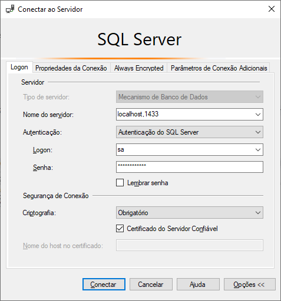

# SQL Server com AdventureWorks no Docker

Um setup Docker pronto para usar com **SQL Server 2022** (Developer Edition) e banco de dados **AdventureWorks2022**.

> Este container foi criado para o uso em desenvolvimento, testes e para fins de estudos.

## Pré-requisitos

- Docker e Docker Compose instalados
- Pelo menos 4GB de memória disponível
- Conexão com internet (para baixar o arquivo .bak do AdventureWorks)

## Como iniciar o container

### 1. Clonar o Repositório

```
git clone https://github.com/cesartomita/sql-server-dev-docker
cd sql-server-dev-docker
```

### 2. Configurar variáveis de ambiente

Copie o arquivo `.env.example` para `.env`:

```powershell
Copy-Item .env.example .env
```

### 3. Construir a imagem e subir o container

```powershell
docker compose up --build
```

### 4. Aguardar inicialização completa

O SQL Server levará alguns minutos para iniciar e restaurar o banco. Quando ver a mensagem abaixo, tudo está pronto:

```
╔═══════════════════════════════════════════════════════════════╗
║    SQL Server e banco de dados AdventureWorks2022 prontos!    ║
╚═══════════════════════════════════════════════════════════════╝
```

### 5. Conectar ao banco de dados

Credenciais padrão para a conexão:

| Campo | Valor |
|-------|-------|
| **Servidor** | localhost,1433 |
| **Usuário** | sa |
| **Senha** | YourStrongPassword123! |
| **Banco de dados** | AdventureWorks2022 |

> Os valores são configuráveis no arquivo [.env](.env).

Exemplo de conexão no *SQL Server Management Studio*:



## Como parar o container

Para parar o container, use o comando abaixo:

```powershell
docker compose down
```

Para remover os volumes de dados também:

```powershell
docker compose down -v
```

## Configurações aplicadas

### SQL Server:

| Configuração | Valor |
|---|---|
| **Edição** | Developer (todas as features) |
| **Idioma** | 1046 (Português BR) |
| **Memória** | 4GB |
| **CPU** | 2 cores |
| **Namespace** | sqlserver |
| **Rede** | Bridge customizada |
| **Volumes** | Separados (dados, backup, logs) |
| **Reinicialização** | Automática (unless-stopped) |
| **Health check** | 90 segundos |

### Parâmetros do `.env`:

| Configuração | Variável | Valor Atual | Descrição |
|---|---|---|---|
| **Senha do SA** | `MSSQL_SA_PASSWORD` | `YourStrongPassword123!` | Senha do usuário administrador (sa) do SQL Server |
| **Porta de acesso** | `MSSQL_CONTAINER_PORT` | `1433` | Porta para conexão ao SQL Server (padrão: 1433) |
| **Nome do banco** | `DB_NAME` | `AdventureWorks2022` | Nome do banco de dados a ser criado |
| **Memória máxima** | `CONTAINER_MEMORY` | `4g` | Limite máximo de memória do container |
| **Limite de CPU** | `CONTAINER_CPUS` | `2` | Número de cores disponíveis |
| **Nome do container** | `CONTAINER_NAME` | `sqlserver-aw` | Nome identificador do container Docker |
| **Edição do SQL Server** | `MSSQL_PID` | `Developer` | Developer (libera features completas) |
| **Idioma** | `MSSQL_LCID` | `1046` | 1046 = Português Brasil |

### Volumes:

Os dados são persistidos em volumes Docker:

- **sqldata** - Arquivos de dados (.mdf)
- **sqlbackup** - Arquivo de backup (.bak) do AdventureWorks
- **sqllog** - Arquivos de log (.ldf)